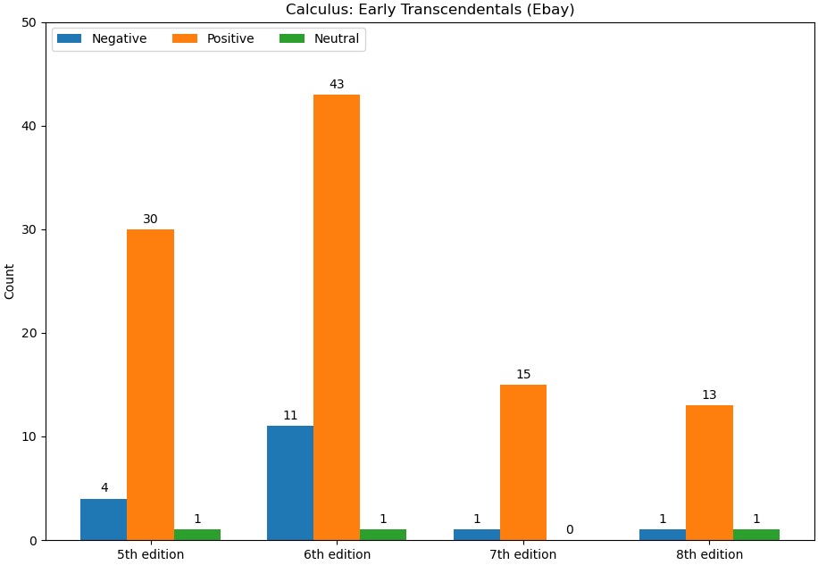

# Project 3

## Description

This program pulls the reviews for several editions of the book Calculus: Early Transcendentals from [Ebay](https://ebay.com) listings and determines the tone of each review using the [Phi-3 Mini](https://ollama.com/library/phi3) LLM. The results are then organized into a grouped bar chart.

## Results

The results are summarized in the following chart:

## Requirements

[Conda](https://github.com/conda/conda)

[Ollama](https://ollama.com)

## Installation

Clone the repository and setup the environment using Conda.

`git clone https://github.com/jennhooks/cs325-project-1.git`

`git checkout project-3`

`conda env create -f requirements.yaml`

`conda activate cs325-project-3`

## Usage

By default, the program assumes the Ollama server is running with Ollama's default configuration (port 11434 on localhost). If this is not the case, use the arguments `--host HOST` and `--port PORT` to specify where the Ollama server is running. In other words, `python main.py` is equivalent to `python main.py --host '127.0.0.1' --port '11434'`

The program can be run in several modes:

`python main.py` Scrape reviews from the urls in input.txt and save them, then pass the reviews to the LLM and save the results of analysis before finally producing a chart of the results. In other words, do all possible computations.

`python main.py --use-cache` Produce a chart using the currently saved "* sentiments.txt" files. No scraping or LLM communication is performed.

`python main.py --sentiments-only` Uses the currently saved "* reviews.txt" files to create the sentiment files. No web scraping or chart creation is performed.

`python main.py --scrape-only` Scrape the reviews from the Ebay product urls in input.txt and save them. No LLM communication or chart creation is performed.
